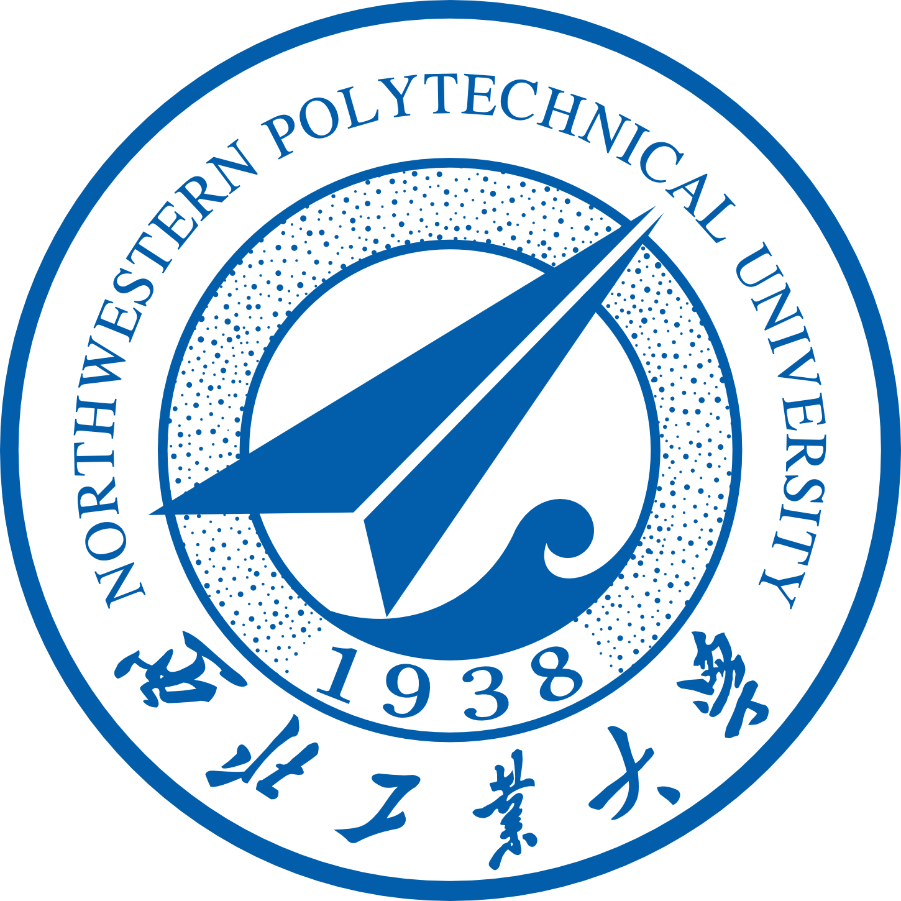
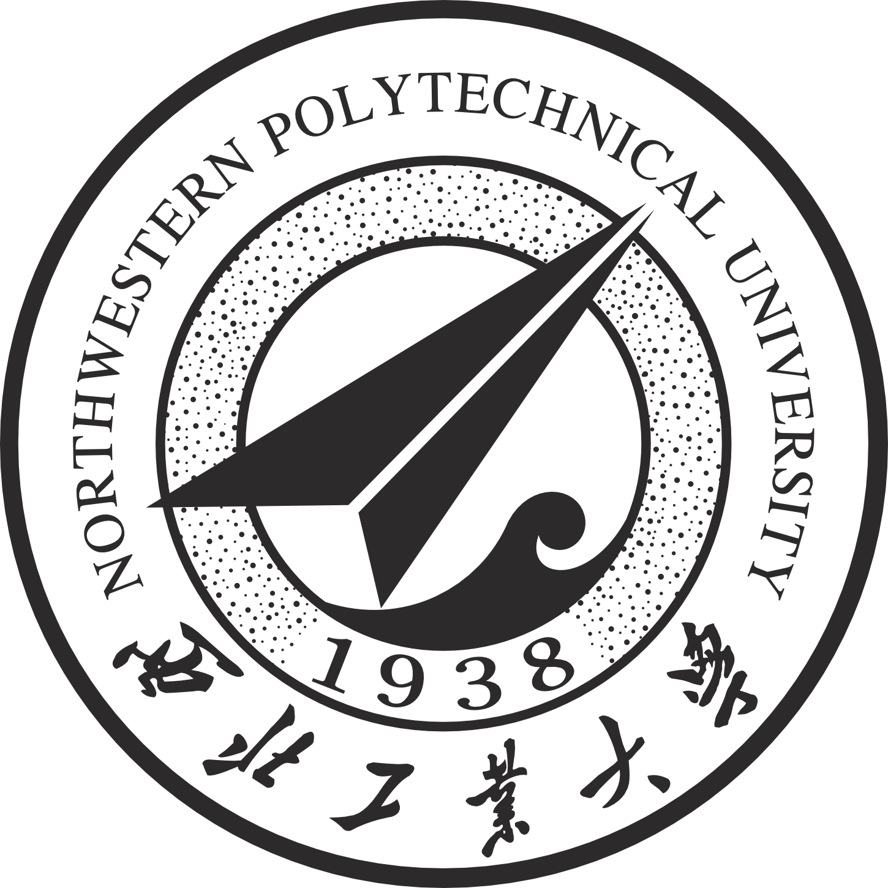
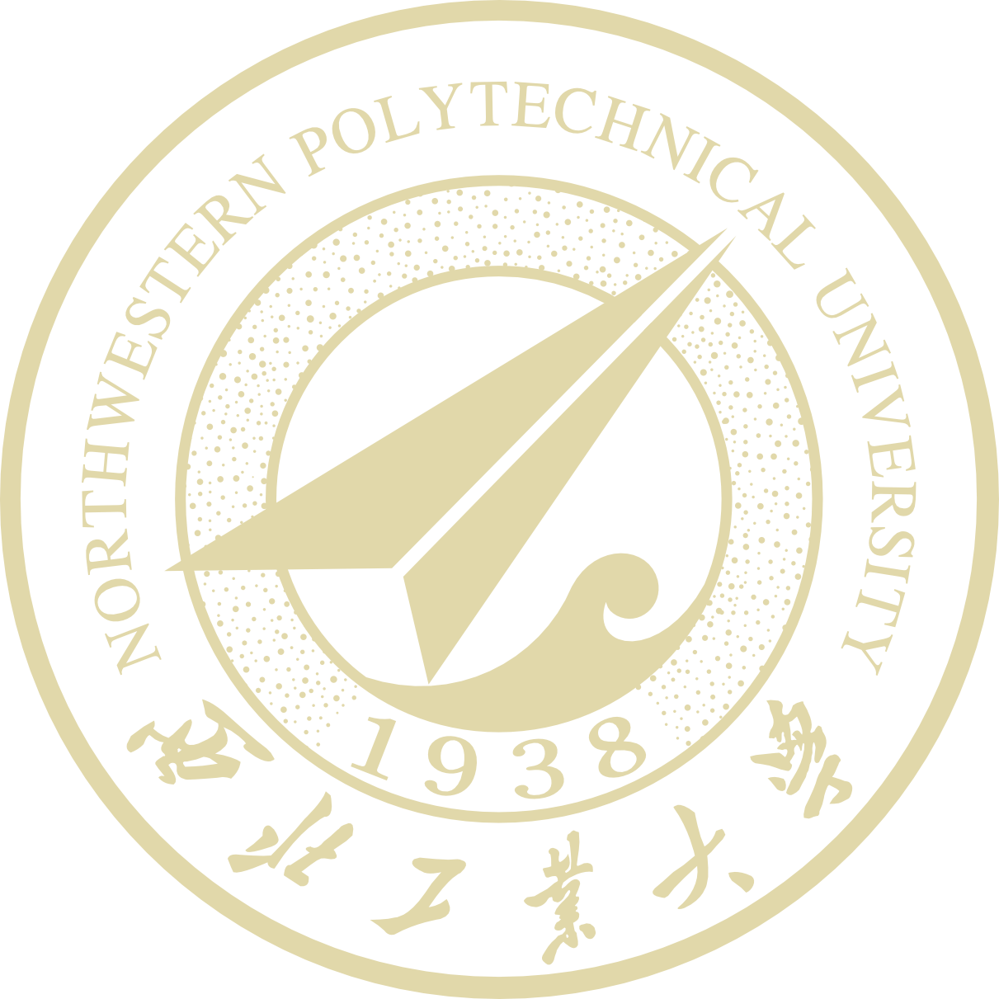
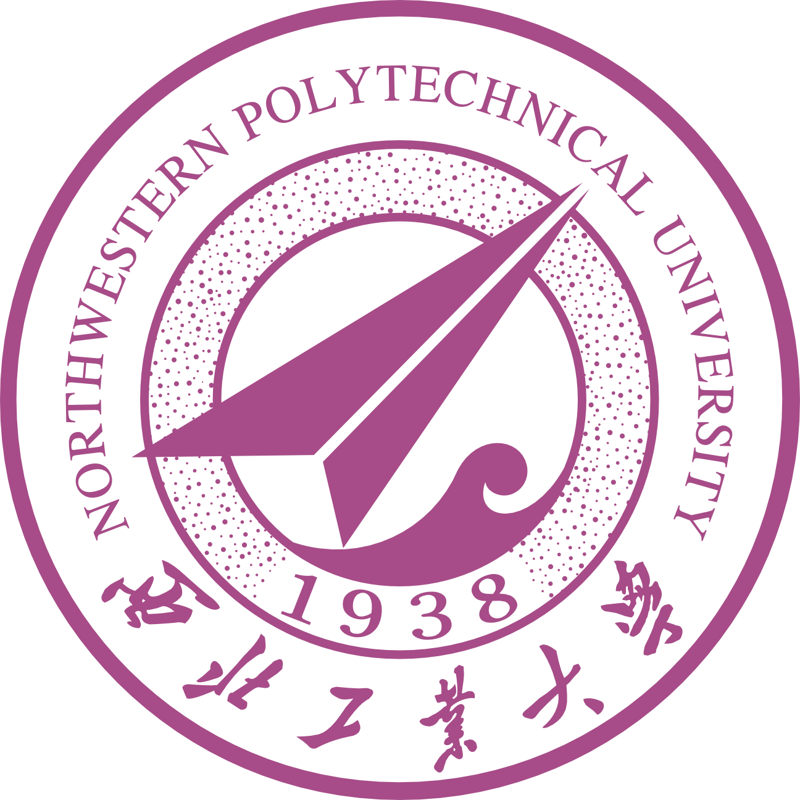
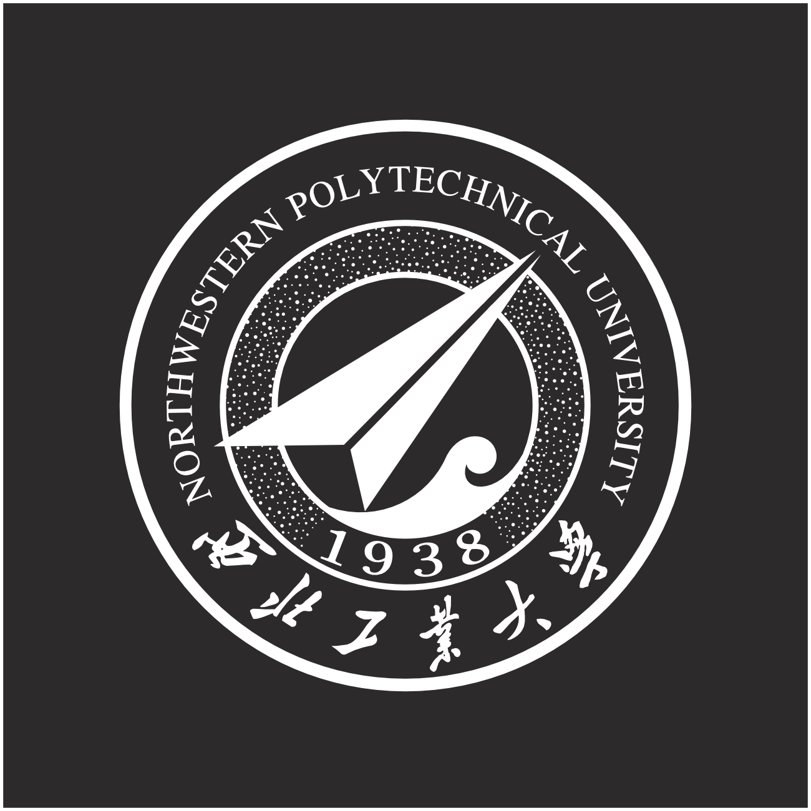
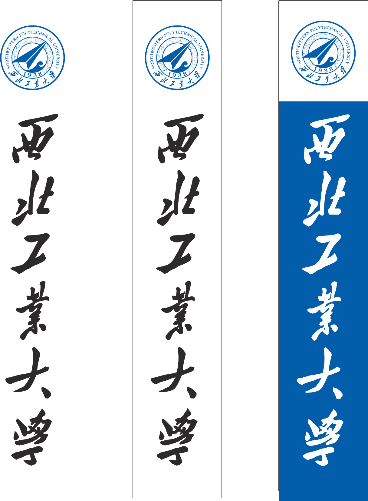
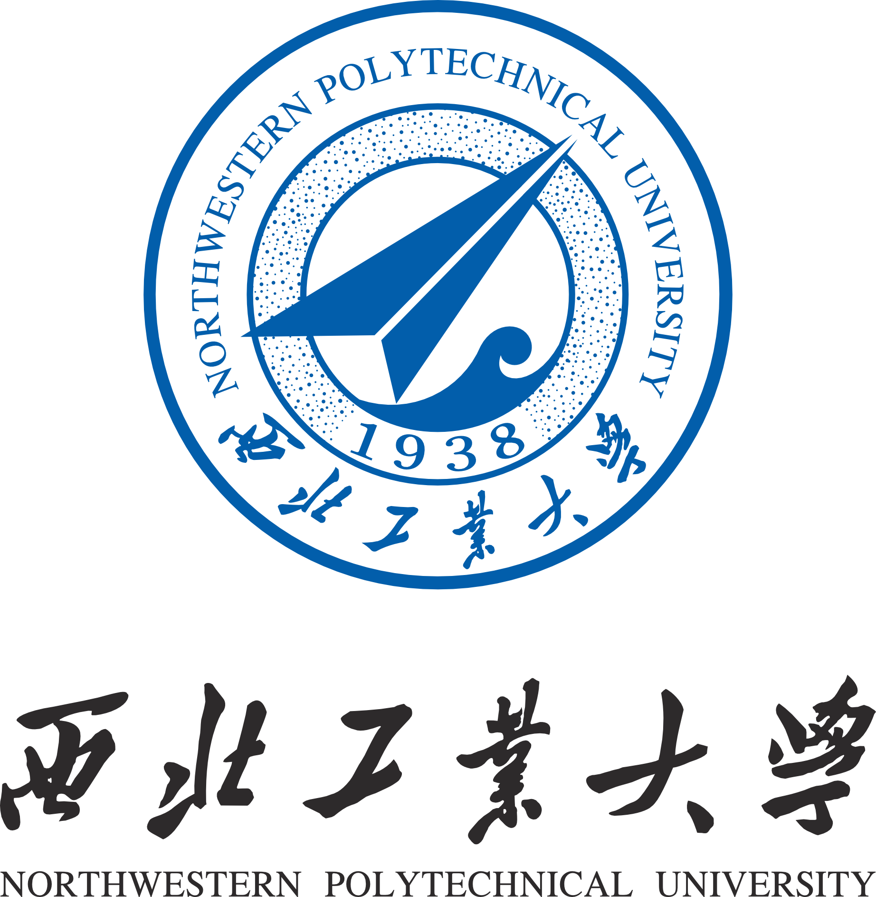

# NPU-LOGO-BANNER
西北工业大学高质量校徽(LOGO)&amp;横幅(BANNER)收集
## Note
本仓库借鉴于[SJTU-logo-banner](https://github.com/weijianwen/SJTU-logo-banner),旨在为工大同学提供
一个便捷的logo&banner获取方式，以制作各种课程设计乃至毕设的封面。所有资源均来源于西北工业大学官网[形象识别系统](https://news.nwpu.edu.cn/xcb/index/xxsbxt.htm)，具体使用规范、版权问题请参见该网站说明。
欢迎有更多更好想法的同学PR！
## Display

